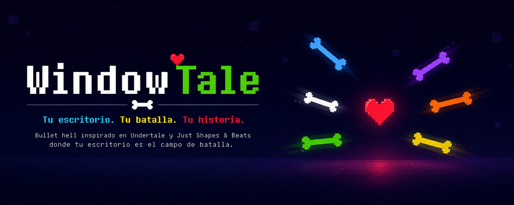
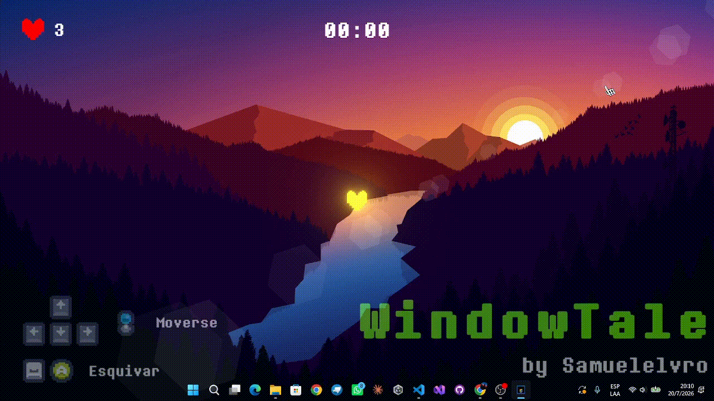
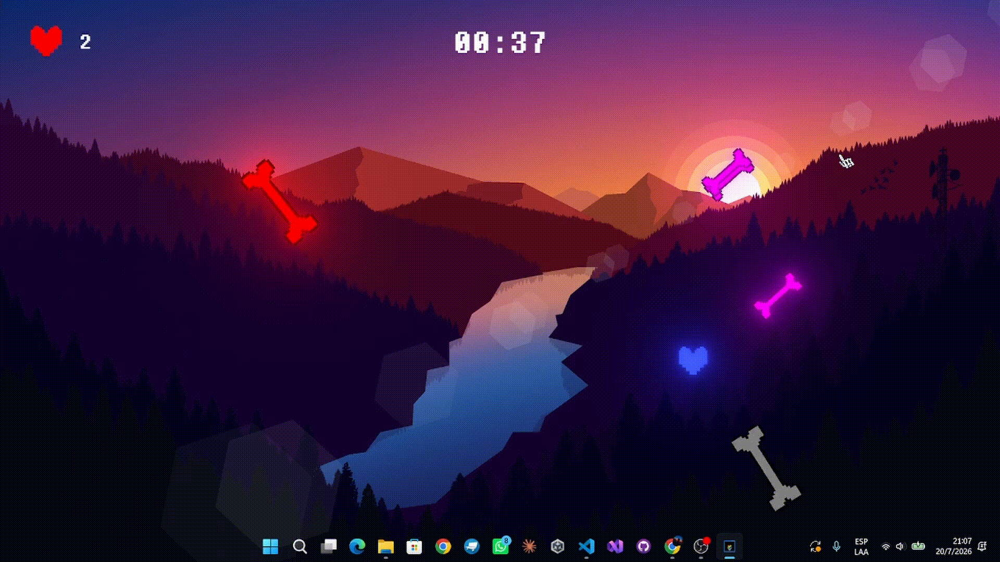
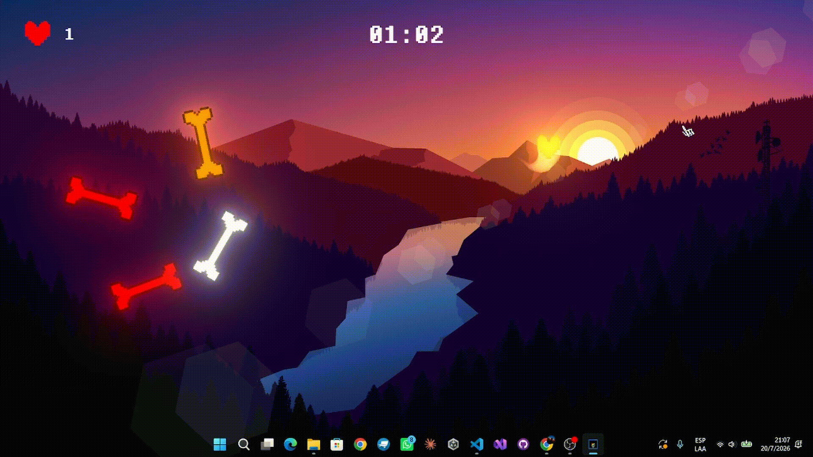

<p align="center">
  
</p>
<h1 align="center">WindowTale</h1>
<p align="center">
<b>Un Bullet Hell donde tu escritorio se convierte en el campo
de batalla.</b>
</p>
<p align="center">
Inspirado en <b>Undertale</b> y <b>Just
Shapes & Beats</b>, WindowTale rompe la cuarta pared utilizando
una ventana transparente que permite jugar directamente sobre el
escritorio de Windows.
</p>
<p align="center">


<a href="https://samuel-duran-cardenas.itch.io/windowtale">
</p>

<br>

# 📑 Índice

-   📖 Descripción
-   ✨ Características
-   🎮 Mecánicas
-   🦴 Tipos de Huesos
-   🎮 Controles
-   🛠 Tecnologías
-   📂 Estructura
-   📸 Capturas
-   🚀 Instalación
-   📈 Estado
-   💡 Desarrollo y Reflexiones
-   👨‍💻 Autor

<br>

# 📖 Descripción

**WindowTale** es un videojuego **Bullet Hell 2D** desarrollado en
**Unity**, donde el jugador controla un corazón que debe sobrevivir a
oleadas de ataques utilizando movimiento preciso y un dash de esquiva.

Su principal característica es el uso de una **ventana transparente**,
permitiendo que el escritorio del usuario forme parte del escenario y
convirtiendo el sistema operativo en el campo de batalla.

<br>

# ✨ Características

-   🖥️ Juego sobre el escritorio de Windows.
-   ❤️ Sistema de vidas.
-   ⚡ Dash con tiempo de reutilización.
-   🌍 Movimiento continuo entre bordes de pantalla.
-   🦴 Enemigos con mecánicas basadas en colores.
-   📈 Dificultad progresiva.
-   🎨 Estética Pixel Art.

<br>

# 🎮 Mecánicas

### ❤️ Supervivencia

Sobrevive el mayor tiempo posible evitando los ataques.<br><br>


### ⚡ Dash

Permite esquivar ataques rápidamente con un breve tiempo de
invulnerabilidad.<br><br>


### 🌍 Movimiento entre bordes

Al salir por un borde de la pantalla el jugador aparece por el lado
contrario.<br><br>


### 📈 Dificultad dinámica

Conforme avanza la partida aumentan la velocidad y la cantidad de
ataques.<br><br>


<br>

# 🦴 Tipos de Huesos

  | Tipo | Mecánica |
  | -------------------- | --------------------------------- |
  |💿 Gris         |    _No hace nada_          |
  |⚪ Blanco         |    Hace daño al contacto.          |
  |🔵 Azul   |           Solo daña cuando el jugador se mueve.   |            
  |🟠 Naranja      |     Solo daña cuando el jugador permanece quieto.    |             
  |🟢 Verde        |     Recupera una vida al tocarlo.  |
  |🔴 Rojo        |      Rebota continuamente por la pantalla.    |
  |🟡 Amarillo   |       Se desplaza con trayectorias especiales. | 
  |🟣 Morado      |      Al impactar contra un borde se fragmenta en múltiples huesos pequeños.  |                   
  ---------------------------------------------------------------------------

<br>


# 🛠 Tecnologías

  |Categoría |   Tecnología|
  |------------| -------------------|
  |Motor |       Unity|
  |Lenguaje   |  C#|
  |UI           |TextMeshPro, UGUI|
  |Render       |Post Processing|
  |Plataforma  | Windows|
 
<br>

# 📂 Estructura del Proyecto

``` text
WindowProject/
├── Assets/
│   ├── Scripts/
│   ├── Scenes/
│   ├── Prefabs/
│   ├── Sprites/
│   └── Audio/
├── Packages/
├── ProjectSettings/
├── Ejecutable/
└── README.md
```

<br>

# 🚀 Instalación

1.  Abrir carpeta de Ejecutable
2. Ejecutar el archivo WindowTale.exe

<br>

# 📈 Estado

  |Característica            | Estado|
  |-------------------------| --------|
  |Movimiento             |      ✅|
  |Dash                  |       ✅|
  |IA de huesos           |      ✅|
  |Sistema de vidas       |      ✅|
  |Ventana transparente    |    ✅|
  |Fragmentación de huesos   |   ✅|

🟢 **Proyecto en desarrollo activo**

<br>

# 💡 Desarrollo y Reflexiones

## 📝 Nota del desarrollador

WindowTale nació como un experimento para explorar una idea poco convencional: convertir el escritorio del usuario en parte del escenario del juego. Inspirado en títulos como Undertale y Rhythm Doctor, el objetivo fue diseñar una experiencia donde la ventana dejara de ser un simple contenedor para convertirse en un elemento de la jugabilidad.

Este proyecto representa mi interés por combinar diseño de videojuegos, programación y experimentación con interfaces no tradicionales.

## 🧠 Decisiones de diseño

- Utilizar una ventana transparente como parte de la experiencia.
- Mantener una estética minimalista para centrar la atención en la jugabilidad.
- Diseñar mecánicas fáciles de comprender pero difíciles de dominar.

## 📚 Aprendizajes

- Manejo de ventanas del SO.
- Diseño de mecánicas de precisión.
- Organización de un proyecto de videojuego desde sus primeras etapas.

## 🔄 ¿Qué haría diferente?

Hoy dedicaría más tiempo al diseño de la arquitectura del proyecto antes de implementar nuevas mecánicas, facilitando su escalabilidad.

<br>

# 👨‍💻 Autor y Medios

**Samuel Durán Cárdenas**

Desarrollador de videojuegos con Unity y C#.<br>

**Itch.io:** https://samuel-duran-cardenas.itch.io/windowtale


<p align="center">
<b>⭐ Si te gustó el proyecto, considera dejar una estrella en
el repositorio.`</b>`{=html}<br><br> Desarrollado con
❤️ por <b>Samuel Durán</b>
</p>
